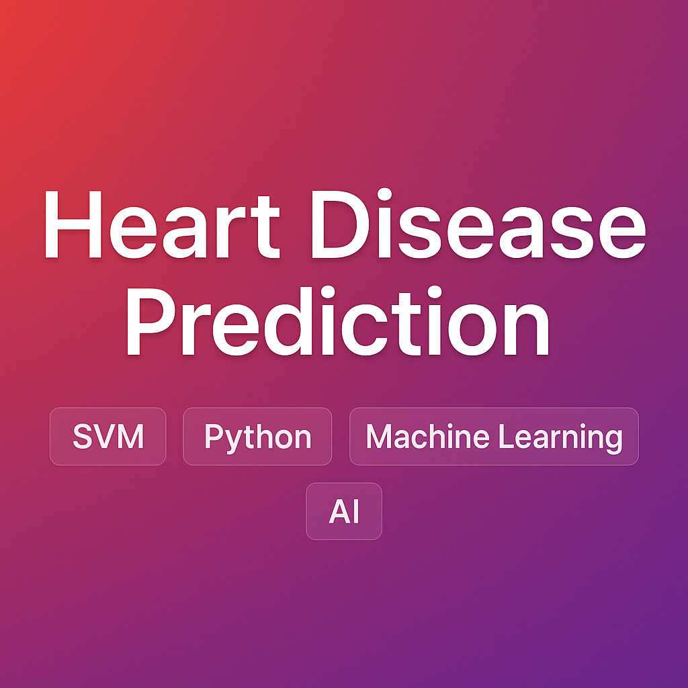

# Heart Disease Prediction using SVM

A Python-based classification model for predicting heart disease using **Support Vector Machine (SVM)**, developed as part of a university task during my Artificial Intelligence studies.

---

##  Overview

This project takes a real dataset of medical information and predicts the likelihood of heart disease using machine learning. It includes full data preparation, label encoding, scaling, parameter tuning with GridSearchCV, and allows user input for real-time prediction.

---

##  Technologies Used

- **Python 3.8+**
- **pandas** – for data manipulation
- **scikit-learn** – for preprocessing and modeling (SVM, GridSearchCV, train/test split, classification report)

---

##  Dataset

- Dataset Source: [Kaggle - Heart Failure Prediction](https://www.kaggle.com/datasets/fedesoriano/heart-failure-prediction)
- The dataset includes features like Age, Sex, ChestPainType, Cholesterol, RestingBP, etc.

---

##  How to Run

1. Make sure Python is installed (`python --version`)
2. Install the required packages:
   ```bash
   pip install pandas scikit-learn
